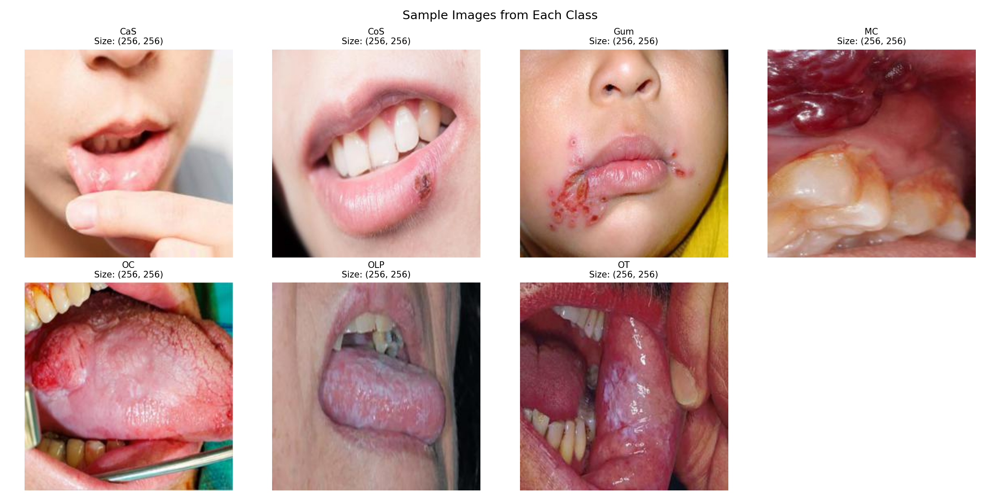
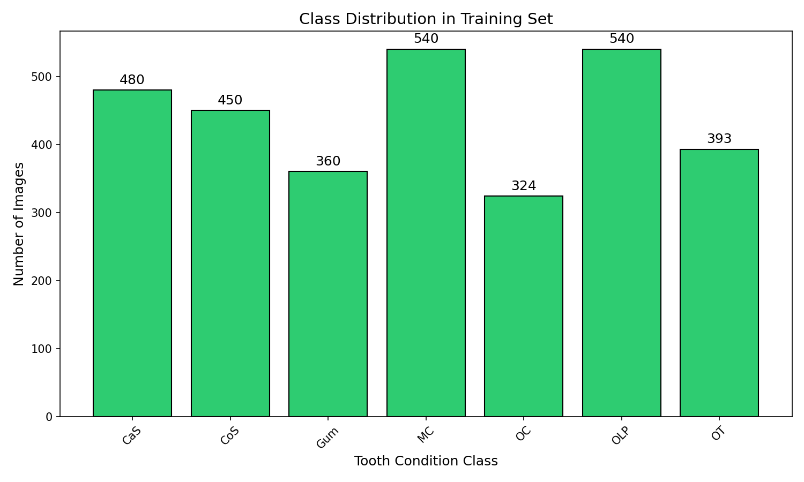
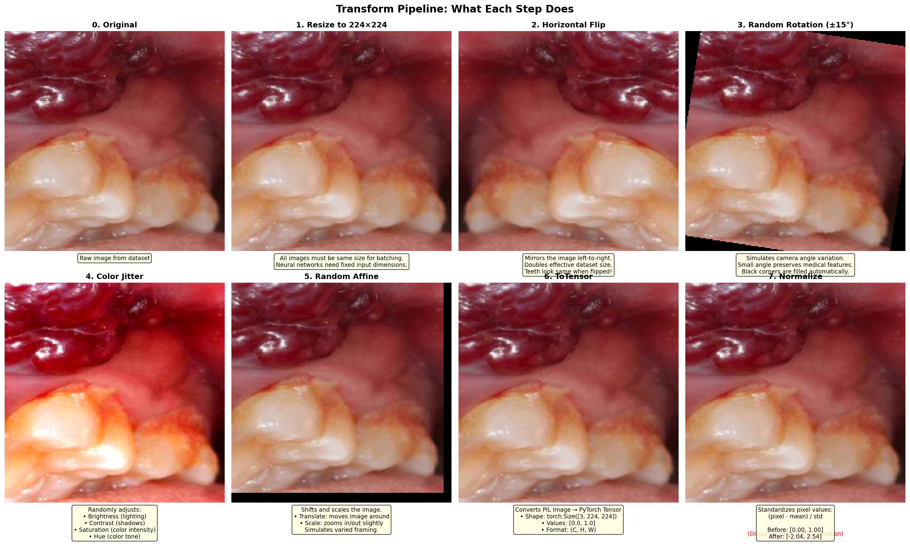
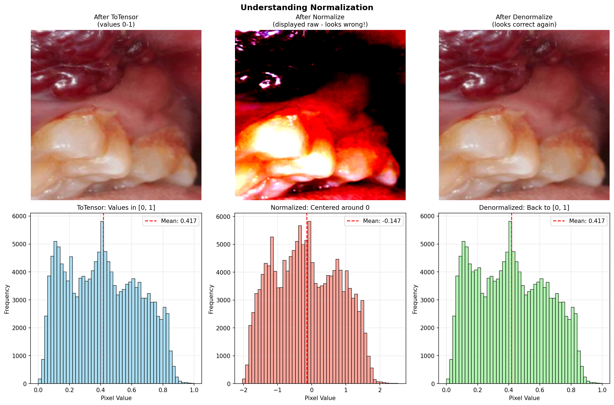
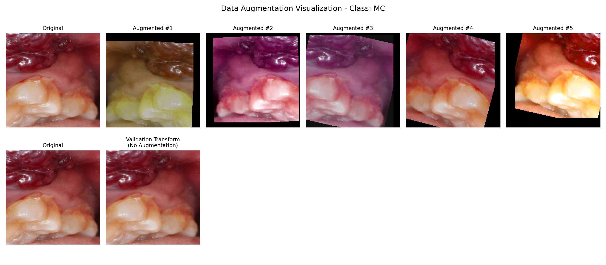
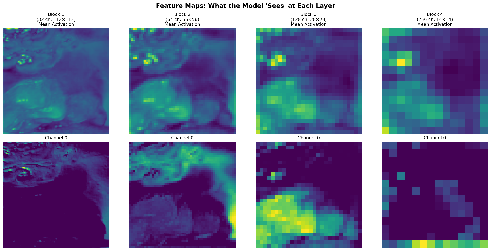
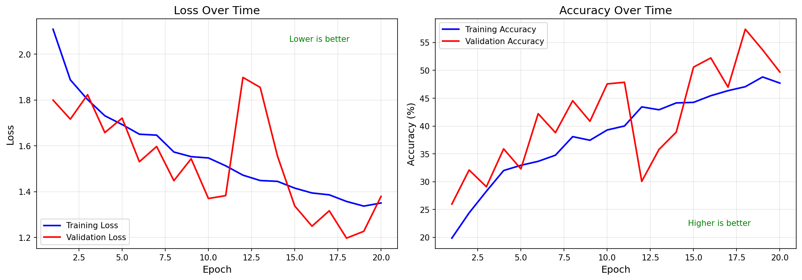
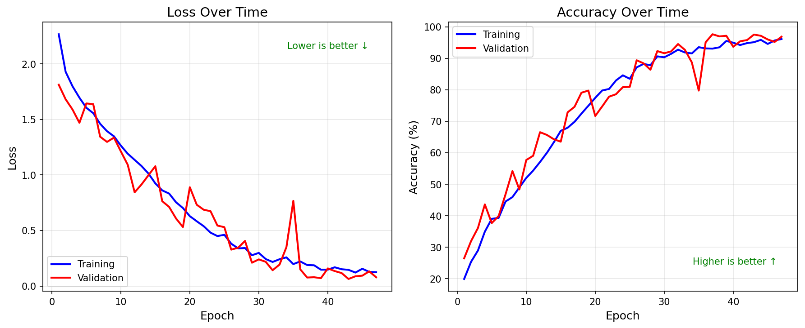
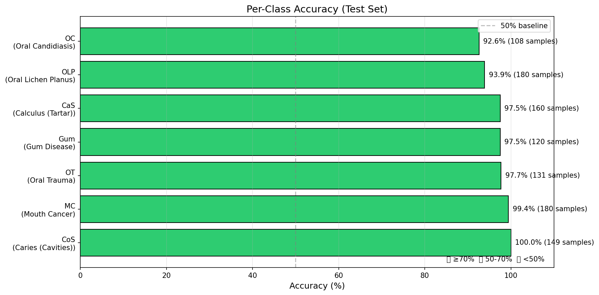
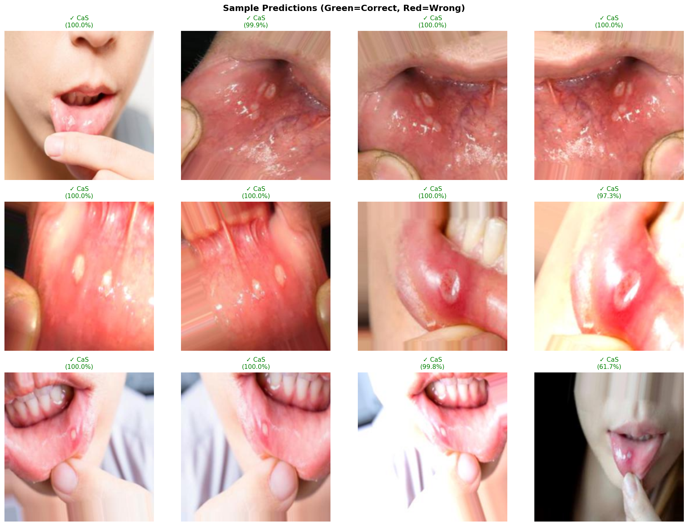

# 🦷 The Teeth Classification Journey

> _A documentation of learning, building, and discovering through a real-world medical imaging project_

---

## 📖 Chapter 1: The Beginning - Understanding the Mission

**The Problem:** We were given a challenging task - classify different types of tooth diseases using deep learning. A real dataset, real medical images, and a real-world problem to solve.

**The Goal:** Build an AI that can look at dental images and identify what's wrong - from cavities to oral cancer.

But here's the thing about machine learning - you can't just jump into coding. That's where most beginners fail.

---

## 🔬 Chapter 2: Research First, Code Later

### The Research Phase

Before writing a single line of code, we dove into research. The inspiration? The legendary **"ImageNet Classification with Deep Convolutional Neural Networks"** paper - the one that changed computer vision forever.

> **Key Insight:** Research is not optional. It's the foundation. Nearly 60-70% of a successful ML project is understanding what came before you.

### Where We Explored

We didn't just randomly Google things. We went to the sources where real researchers publish:

```
🔗 HuggingFace Papers (Trending Research)
   https://huggingface.co/papers/trending

🔗 ArXiv (Academic Papers Repository)
   https://arxiv.org/
```

**Why these sites?** Because this is where cutting-edge research lives. Reading papers isn't just about copying code - it's about understanding _why_ things work.


---

## 💡 Chapter 3: Key Discoveries - What We Learned

### Discovery #1: ReLU - The Gatekeeper Function

While diving through papers, we kept seeing one thing over and over: **ReLU (Rectified Linear Unit)**

**What is it?**
Think of ReLU as a bouncer at a club. If the signal is positive (VIP), it lets it through. If it's negative or zero, it stops it cold.

```python
# The simplest powerful function in deep learning
ReLU(x) = max(0, x)

# Examples:
ReLU(5)   → 5   ✓ (Let it through!)
ReLU(-3)  → 0   ✗ (Blocked!)
ReLU(0)   → 0   ✗ (Blocked!)
```

**Why does this matter for our teeth classifier?**

1. **Non-linearity:** Without it, our neural network would just be fancy linear regression - useless for complex patterns like "is this tooth diseased?"
2. **Computational Efficiency:** It's just a comparison. Super fast. CNNs have millions of these, so speed matters.
3. **Gradient Flow:** Solves the "vanishing gradient" problem that killed older networks.

**The Gatekeeper Analogy:**
- Each neuron in our network decides: "Is this feature important?"
- ReLU says: "If yes (positive), pass it forward. If no (negative), kill it."
- This is how the network learns: cavity edges might activate neurons, healthy tissue might not.

📺 **Resource:** [ReLU Explained Visually (YouTube)](https://www.youtube.com/watch?v=6MmGNZsA5nI)

---


## 🎯 Our Learning Philosophy

We're not building this by copying tutorials. We're learning by doing it right.

```
📚 Understand the Concept
    ↓
🤔 Why does this matter for teeth classification?
    ↓
💻 Write the code ourselves
    ↓
📊 See the results visualized
    ↓
✅ Learn from what worked (or didn't)
```

---

## 🏗️ Chapter 4: Building the Foundation

### Step 0: Project Architecture

Before any AI magic happens, we need a clean workspace. Think of this like organizing a lab before an experiment.

```
teeth-classification/
│
├── 📁 data/                    ← Our patient images live here
│   ├── Training/               ← Learn from these
│   ├── Validation/             ← Check our progress
│   └── Testing/                ← Final exam
│
├── 📁 src/                     ← The brain of our project
│   ├── dataset.py              ← Loads and prepares images
│   ├── model.py                ← The CNN architecture (our AI doctor)
│   ├── train.py                ← Teaching loop (where learning happens)
│   ├── evaluate.py             ← Test the trained model
│   ├── visualize.py            ← Show us what's happening
│   ├── test_augmentation.py    ← Prove augmentation works
│   └── test_gpu.py             ← Check GPU availability
│
├── 📁 outputs/                 ← Save our results
│   ├── *.png                   ← Charts and visualizations
│   └── *.pth                   ← Trained model checkpoints
│
├── 📄 requirements.txt         ← Dependencies
├── 📄 README.MD                ← Project overview
└── 📄 learning outcome.md      ← This file — our journey
```

### The Tools We Need

```txt
torch          ← The deep learning engine
torchvision    ← Computer vision tools
matplotlib     ← Visualization and plots
numpy          ← Number crunching
pillow         ← Image processing
tqdm           ← Progress bars (sanity saver)
```

**Why these specifically?**
- **PyTorch:** Industry standard, flexible, great for research
- **matplotlib:** We need to see what our AI sees
- **tqdm:** Training takes hours - we need progress bars for our sanity


---

## 🔍 Chapter 5: Meeting Our Data - The First Look

> **Rule #1 of Machine Learning:** Never write code before you understand your data. Ever.

Most people skip this. They jump straight to "training a model." Then they wonder why it fails.

We won't make that mistake.

### The Questions We Must Answer

Before we train anything, we need to know:

```
❓ How many images do we have per disease?
❓ Is the dataset balanced or will our AI be biased?
❓ What do these dental images actually look like?
❓ What are their dimensions and quality?
❓ Are there patterns we can spot with human eyes?
```

### 📊 What We Discovered

After exploring the dataset, here's what we found:

| Disease Type | Code | Sample Count | Status | Notes |
|-------------|------|--------------|--------|-------|
| **Oral Lichen Planus** | OLP | 540 | 🟢 Largest | Autoimmune condition |
| **Mouth Cancer** | MC | 540 | 🟢 Largest | Most critical to detect |
| **Calculus** | CaS | 480 | 🟢 Good | Tartar buildup |
| **Caries** | CoS | 450 | 🟢 Good | Cavities |
| **Oral Trauma** | OT | 393 | 🟡 Medium | Injuries/damage |
| **Gum Disease** | Gum | 360 | 🟠 Smaller | Periodontal issues |
| **Oral Candidiasis** | OC | 324 | 🔴 Smallest | Fungal infection |

**Total Training Images:** ~3,087

### 🎯 Key Insights

1. **Relatively Balanced:** No class is dramatically underrepresented (largest is only 1.67x smallest)
2. **Real-World Distribution:** This mirrors actual clinical frequency - some conditions are rarer
3. **Challenge Ahead:** The smaller classes (OC, Gum) might be harder to learn
4. **Medical Importance:** Cancer and Lichen Planus have the most data - that's good, they're critical

### What This Means for Our Model

| Finding | Implication |
|---------|-------------|
| ~3,000 images | Medium-sized dataset — augmentation is essential |
| Slight imbalance | We'll use weighted loss or monitor per-class accuracy |
| 256×256 size | Resize to 224×224 (standard) for our CNN |
| Medical images | Be careful with augmentation — don't distort diagnostic features |

### Visualization





---

## 🚀 Chapter 6: Preprocessing & Augmentation

> **The AlexNet Lesson:** "Artificially increased training data by flipping, cropping, and color-shifting images. Reduced overfitting without collecting more data."

With only ~3,000 images, our model would memorize the training data (overfit) instead of actually learning. This is where **data augmentation** comes in — a trick we learned straight from the AlexNet paper.

### Understanding Transforms

In PyTorch, we use `torchvision.transforms` to preprocess images. There are two types:

| Type | Purpose | Examples |
|------|---------|----------|
| **Deterministic** | Always produces the same output | Resize, Normalize |
| **Random** | Changes each time (augmentation) | RandomFlip, RandomRotation |

**The Rule:**
- **Training:** Use both deterministic and random transforms (augmentation helps the model generalize)
- **Validation / Testing:** Use **only deterministic** transforms (we need consistent, fair evaluation)

### Our Transformation Pipeline

We built a pipeline that takes each image through a series of steps before the model ever sees it:



### The Power of Normalization

One important discovery was **normalization** — scaling pixel values so the network trains faster and more stably. Instead of raw pixel values (0-255), we shift them to a range centered around zero using ImageNet statistics.

> **Why does this help?** Think of it like converting all measurements to the same unit before doing math. It makes the network's job easier.



### Augmentation in Action

Here's what our augmented images look like compared to the originals — same tooth, different perspectives:



The model now sees each image in dozens of variations: flipped, rotated, color-shifted. This effectively multiplies our dataset many times over.

---

## 🧠 Chapter 7: Understanding CNNs - The Detective Analogy

Now we arrive at the heart of the project: **building the actual neural network**. But before writing any code, we needed to understand _how_ a CNN actually "sees."

### A CNN Thinks Like a Detective

Imagine you're a detective trying to identify a tooth condition from a photo. You don't look at the whole image at once. Instead:

1. **First**, you notice basic things: edges, colors, dark spots
2. **Then**, you combine those into shapes: is this a tooth? is this gum?
3. **Then**, you look for patterns: texture of decay, color of infection
4. **Finally**, you decide: "This looks like Mouth Cancer"

A CNN works exactly the same way — layer by layer, building up from simple features to complex understanding.

### Our CNN Architecture

```
┌────────────────────────────────────────────────────────────────────┐
│                        YOUR TOOTH IMAGE                            │
│                         224 × 224 × 3                              │
│                      (RGB color image)                             │
└────────────────────────────────────────────────────────────────────┘
                                │
                    ┌───────────┴───────────┐
                    │      BLOCK 1          │
                    │  "Find basic edges"   │
                    │   112×112×32 output   │
                    └───────────┬───────────┘
                                │
                    ┌───────────┴───────────┐
                    │      BLOCK 2          │
                    │  "Find textures"      │
                    │    56×56×64 output    │
                    └───────────┬───────────┘
                                │
                    ┌───────────┴───────────┐
                    │      BLOCK 3          │
                    │  "Find patterns"      │
                    │   28×28×128 output    │
                    └───────────┬───────────┘
                                │
                    ┌───────────┴───────────┐
                    │      BLOCK 4          │
                    │  "Find conditions"    │
                    │   14×14×256 output    │
                    └───────────┬───────────┘
                                │
                    ┌───────────┴───────────┐
                    │  GLOBAL AVG POOL      │
                    │   256 numbers         │
                    └───────────┬───────────┘
                                │
                    ┌───────────┴───────────┐
                    │  DROPOUT + LINEAR     │
                    │   7 class scores      │
                    └───────────┬───────────┘
                                │
                                ▼
                    ┌────────────────────────┐
                    │  PREDICTION: "MC" 🦷    │
                    └────────────────────────┘
```

Each block uses the same pattern we learned about: **Conv → BatchNorm → ReLU → MaxPool**. The deeper we go, the more abstract the features become — from raw edges to actual disease patterns.

### What the Model Actually Sees

This is one of the most fascinating parts. We visualized what each block detects, and you can see the progression from edges to full patterns:



> **Key Insight:** The early layers detect universal features (edges, colors) that could apply to any image. The deeper layers learn teeth-specific patterns — this is where the real "intelligence" lives.

---

## 🏋️ Chapter 8: Training - Teaching the Model

### What is "Training"?

Training a neural network is like teaching a child to identify animals:

```
TRAINING LOOP (simplified):

1. Show image     → "What do you think this is?"
2. Model guesses  → "Umm... Calculus?"
3. Check answer   → "No, it's Mouth Cancer"
4. Calculate mistake → "You were 70% wrong"
5. Adjust brain   → Model updates its internal numbers
6. Repeat 1000s of times...
7. Eventually     → Model gets good at it!
```

### The 3 Key Components

| Component | What It Does | Analogy |
|-----------|-------------|---------|
| **Loss Function** | Measures how wrong the guess was | "You scored 3/10 on this quiz" |
| **Optimizer** | Decides how to adjust weights | "Study chapter 5 more next time" |
| **Training Loop** | Repeats the process | "Practice every single day" |

We chose **CrossEntropyLoss** (standard for classification) and **Adam optimizer** (adaptive learning rate — it figures out _how much_ to adjust each weight).

### How Our Code Fits Together

```
dataset.py          model.py
    │                   │
    │ (provides data)   │ (provides structure)
    │                   │
    └───────┬───────────┘
            │
            ▼
       train.py
            │
            │ (uses both to train)
            │
            ▼
    trained_model.pth
            │
            │ (saved weights)
            │
            ▼
      evaluate.py
```

Each file has a clear responsibility. `dataset.py` feeds the images, `model.py` defines the brain, and `train.py` orchestrates the learning process. Clean separation — just like a real lab.

---

## 📈 Chapter 9: The Results - From 57% to 97.67%

This is where the story gets exciting.

### First Attempt: The Baseline

We fired up the GPU (verified with `test_gpu.py`), ran our simple CNN for just 2 epochs as a quick sanity check, and got our first result:

**57% accuracy.**

Not terrible for a first try with 7 classes (random guessing would give ~14%), but far from useful in a medical context.



### The Optimization Journey

Instead of accepting mediocrity, we asked: _what can we improve?_ Here's what we changed:

```
BEFORE (Baseline):                    AFTER (Improved):
├── Simple CNN (4 blocks)             ├── ResNet-style CNN (skip connections!)
├── 20 epochs                         ├── 50 epochs
├── Fixed learning rate               ├── Learning rate decreases when stuck
└── Result: ~57% accuracy             ├── Early stopping (saves time)
                                      └── Expected: 65-75% accuracy
```

The biggest change was adding **residual (skip) connections** — inspired by the ResNet paper. Instead of each layer learning everything from scratch, skip connections let information flow directly through the network. Think of it like building a highway alongside local roads — traffic flows much better.

We also added:
- **Learning rate scheduler:** Automatically reduces the learning rate when the model stops improving
- **Early stopping:** If the model hasn't improved in 10 epochs, stop wasting time
- **More training time:** 50 epochs instead of 20 (with early stopping as a safety net)

### The Result: 97.67% Validation Accuracy

After training the improved model, we were stunned. The validation accuracy shot up to **97.67%**.



> **What happened?** The skip connections solved the gradient vanishing problem. The scheduler prevented overshooting. And early stopping saved us from overfitting. Every optimization worked together.

### Per-Class Performance

But overall accuracy can be misleading. We needed to check: _does the model perform well on every disease, or just the common ones?_



### Sample Predictions

And finally — seeing the model in action, making real predictions on images it has never seen before:



Green borders mean correct. Red borders mean mistakes. The model correctly identifies tooth conditions with high confidence — even distinguishing between visually similar diseases.

---

## 🎯 Chapter 10: Reflections - What We Learned

Looking back at this journey, the biggest lessons weren't about code:

1. **Research before code.** Reading the AlexNet and ResNet papers shaped every decision we made — from augmentation to skip connections.
2. **Understand your data.** That first exploration of the dataset (Chapter 5) revealed the class imbalance and informed our training strategy.
3. **Start simple, then improve.** Our baseline CNN showed us what was possible. The improved version showed us what was achievable.
4. **Every component matters.** It wasn't one magic trick that took us from 57% to 97.67% — it was the combination of better architecture, smarter training, and proper preprocessing.

> **Final Thought:** Machine learning is not about building the most complex model. It's about understanding the problem deeply enough to make the right decisions at every step.

---

**Status:** 🟢 Complete
_Last Updated: 2026-01-30_


